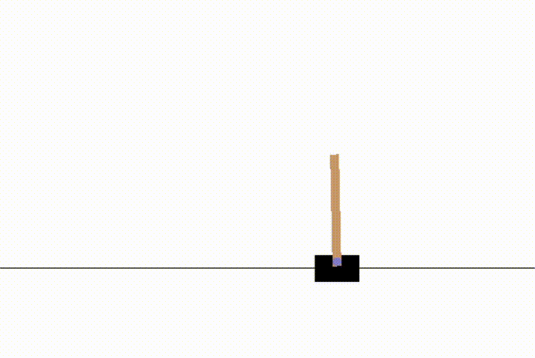
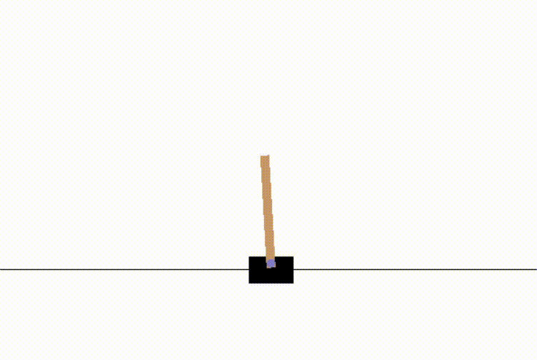

#DQN Cartpole


Pytorch implementation of this [link](https://pytorch.org/tutorials/intermediate/reinforcement_q_learning.html)<br />
And I added another network using Multi-layer Perception by using state from openai gym directly

##Requirements
- Python 3.6x or higher 
- pytorch v1.0.0
- [gym](https://github.com/openai/gym/)
- torchvision
- PIL
- matplotlib
- numpy

##Run
###Train Model
```python train.py [options]```<br/>

###Test Mdoel
```pyton test.py [options]```

##Arguments
Every argument is optional, and has a default value defined at arguments.py.

### Train
- ```--model, -m```: dnn or cnn. *Default*: dnn
- ```--load_path, -l```: Path of model file. *Default*: None
- ```--num_episode, -e```: Number of episode. *Default*: 1000
- ```--batch_size, -s```: Size of batch from Replay Memory. *Default*: 128
- ```--gamma, -g```: Discount factor of reward. *Default*: 0.999
- ```--eps_start, -es```: Start value of epsilon. *Default*: 0.9
- ```--eps_end, -ee```: End value of epsilon. *Default*: 0.05
- ```--eps_decay, -ed```: epsilon = exp(eps_decay * steps_done). *Default*: 0.005
- ```--target_update, -t```: Number of episode needed to update target network. *Default*: 10
- ```--replay_memory_capacity, -c```: Capacity of Replay Memory. *Default*: 5000

### Test
- ```--model, -m```: dnn or cnn. *Default*: dnn
- ```--load_path, -l```: Path of model file. *Default*: ./models/dnn/reward_760.pt
- ```--num_episode, -e```: Number of episode. *Default*: 5

##Results
###DNN


###CNN

